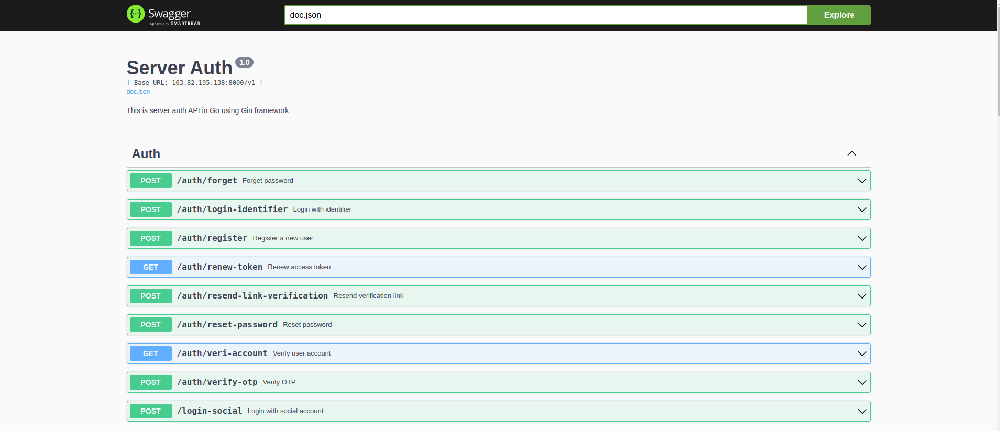
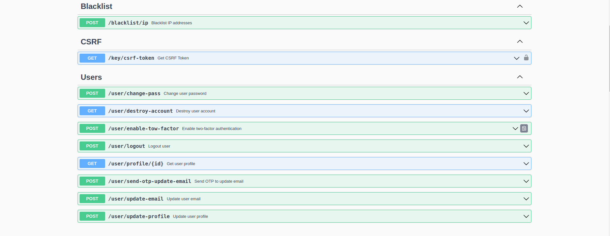

<p align="center">
  <a href="https://profile-forme.com/" target="_blank">
    
  </a>
</p>

<p align="center">
  <a href="https://www.linkedin.com/in/tai-nguyen-tien-787545213/">
    
  </a>
  <a href="https://profile-forme.surge.sh">
    
  </a>
  <a href="tel:0798805741">
    
  </a>
  <a href="mailto:nguyentientai10@gmail.com">
    
  </a>
</p>

# Project: **Code Go Secure Mastering Auth Pro**
## Description: This is a project built to language Go change for Nodejs with performance so well. The target when I write this project is to service the company system and check performance before going into the project.
## Notice: If you have any problems, you can contact me or create an issue me to read and fix it, thank all guys.

## Technology Stack: 
- **Backend**: Go + Gin
- **Database**: PostgreSQL
- **Lib**: Have a lot of libraries to service the project.
- **Cache**: Redis

---

## Description: This is a project about feature auth and security. It has been a coding language go and will continue development with a new feature.

## Note: We will have 2 kinds of languages, Vietnamese and English.

<!-- go run gif -->
<div align="center">
  <a href="https://go.dev/"></a>
</div>

---

<!-- go run gif -->

## 🗂 **Folder Structure**

```plaintext
.
├── .dockerignore
├── .env
├── .env.example
├── .gitignore
├── .vscode/
│   └── settings.json
├── cmd/
│   ├── cli/
│   ├── cronjob/
│   ├── queue/
│   └── server/
├── configs/
│   ├── common/
│   ├── config.go
│   └── yaml/
├── docker-compose.dev.yml
├── docker-compose.pro.yml
├── docs/
│   ├── assets/
│   ├── CODE.md
│   ├── CODETABLE.md
│   ├── GO.md
│   ├── postman/
│   └── swagger/
├── fsnotify.go
├── global/
├── go.mod
├── go.sum
├── internal/
│   ├── controllers/
│   ├── messaging/
│   ├── middlewares/
│   ├── models/
│   └── repo/
├── makefile
├── migrations/
├── pkg/
├── response/
├── scripts/
├── sqlc.yaml
├── templates/
├── tests/
├── third_party/
└── tmp/
```

# Tài liệu bằng tiếng Vietnamese 🇻🇳.

- `.dockerignore`: Chứa danh sách các tệp và thư mục mà Docker sẽ bỏ qua khi xây dựng hình ảnh.
- `.env`: Chứa các biến môi trường cho dự án.
- `.env.example`: Một ví dụ về tệp `.env` chứa các biến môi trường cần thiết, dùng để hướng dẫn.
- `.github/`: Chứa các tệp cấu hình cho GitHub, như `FUNDING.yml` để cấu hình tài trợ.
- `.gitignore`: Chứa danh sách các tệp và thư mục mà git sẽ bỏ qua.
- `.vscode/`: Chứa cấu hình cho Visual Studio Code, như `settings.json`.
- `cmd/`: Chứa các điểm vào của ứng dụng như CLI, cronjob, hàng đợi, và máy chủ.
- `configs/`: Chứa các tệp cấu hình cho ứng dụng, bao gồm cả cấu hình chung và cấu hình dưới dạng tệp YAML.
- `docker-compose.dev.yml` và `docker-compose.pro.yml`: Chứa cấu hình Docker Compose cho môi trường phát triển và sản xuất.
- `docs/`: Chứa tài liệu dự án, bao gồm cả mã hóa, bảng mã, Go, Postman và Swagger.
- `fsnotify.go`: Tệp này có thể chứa mã để theo dõi các thay đổi tệp hệ thống.
- `global/`: Chứa các biến toàn cục cho ứng dụng.
- `go.mod` và `go.sum`: Quản lý các phụ thuộc của dự án Go.
- `GUILD.md`: Có thể là hướng dẫn hoặc thông tin về cách tham gia và đóng góp cho dự án.
- `internal/`: Chứa mã nguồn nội bộ của ứng dụng, không dành cho việc tái sử dụng bên ngoài.
- `makefile`: Chứa các lệnh tự động hóa cho việc xây dựng và quản lý dự án.
- `migrations/`: Chứa các tệp di cư cơ sở dữ liệu.
- `pkg/`: Chứa các thư viện và gói có thể tái sử dụng bên ngoài dự án.
- `README.md`: Tệp này chứa thông tin tổng quan và hướng dẫn cho dự án.
- `response/`: Có thể chứa mã để xử lý và trả về các phản hồi HTTP.
- `scripts/`: Chứa các kịch bản hỗ trợ cho việc phát triển và triển khai.
- `sqlc.yaml`: Cấu hình cho sqlc, một công cụ tự động hóa việc viết mã từ SQL.
- `templates/`: Chứa các mẫu cho giao diện người dùng hoặc tệp khác.
- `tests/`: Chứa các bài kiểm tra tự động cho dự án.
- `third_party/`: Chứa mã từ các dự án bên thứ ba.
- `tmp/`: Thư mục tạm thời cho các tệp được tạo ra trong quá trình phát triển.

# Document to language English 🏴󠁧󠁢󠁥󠁮󠁧󠁿

- `.dockerignore`: Contains a list of files and directories that Docker should ignore when building an image.
- `.env`: Contains environment variables for the project.
- `.env.example`: An example `.env` file containing necessary environment variables, meant to guide setup.
- `.github/`: Contains configuration files for GitHub, like `FUNDING.yml` for sponsorship settings.
- `.gitignore`: Contains a list of files and directories that git should ignore.
- `.vscode/`: Contains configurations for Visual Studio Code, such as `settings.json`.
- `cmd/`: Contains the application's entry points like CLI, cronjob, queue, and server.
- `configs/`: Contains configuration files for the application, including common configurations and configurations in YAML format.
- `docker-compose.dev.yml` and `docker-compose.pro.yml`: Contain Docker Compose configurations for development and production environments.
- `docs/`: Contains project documentation, including coding standards, code tables, Go guidelines, Postman collections, and Swagger files.
- `fsnotify.go`: This file may contain code to monitor file system changes.
- `global/`: Contains global variables for the application.
- `go.mod` and `go.sum`: Manage the project's Go dependencies.
- `GUILD.md`: May contain guidelines or information on how to join and contribute to the project.
- `internal/`: Contains the application's internal source code, not intended for external reuse.
- `makefile`: Contains automation commands for building and managing the project.
- `migrations/`: Contains database migration files.
- `pkg/`: Contains libraries and packages that can be reused outside the project.
- `README.md`: This file contains an overview and instructions for the project.
- `response/`: May contain code for handling and returning HTTP responses.
- `scripts/`: Contains support scripts for development and deployment.
- `sqlc.yaml`: Configuration for sqlc, a tool for generating code from SQL.
- `templates/`: Contains templates for user interfaces or other files.
- `tests/`: Contains automated tests for the project.
- `third_party/`: Contains code from third-party projects.
- `tmp/`: A temporary directory for files created during development.

# API Swagger




---
## 📚 Dạy Học Online

Bên cạnh tài liệu miễn phí, mình còn mở các khóa học online:

- **Lập trình web cơ bản → nâng cao**
- **Ứng dụng về AI và Automation**
- **Kỹ năng phỏng vấn & xây CV IT**

### Thông Tin Đăng Ký

- 🌐 Website: [codewebkhongkho.com](https://codewebkhongkho.com/portfolios)
- 📧 Email: nguyentientai10@gmail.com
- 📞 Zalo/Hotline: 0798805741

---

## 💖 Donate Ủng Hộ

Nếu bạn thấy các source hữu ích và muốn mình tiếp tục phát triển nội dung miễn phí, hãy ủng hộ mình bằng cách donate.  
Mình sẽ sử dụng kinh phí cho:

- 🌐 Server, domain, hosting
- 🛠️ Công cụ bản quyền (IDE, plugin…)
- 🎓 Học bổng, quà tặng cho cộng đồng

### QR Code Ngân Hàng

Quét QR để ủng hộ nhanh:


**QR Code ABBank**  
- Chủ tài khoản: Nguyễn Tiến Tài  
- Ngân hàng: NGAN HANG TMCP AN BINH  
- Số tài khoản: 1651002972052

---

## 📞 Liên Hệ
- 📚 Tiktok Dạy Học: [@code.web.khng.kh](https://www.tiktok.com/@code.web.khng.kh)
- 💻 GitHub: [fdhhhdjd](https://github.com/fdhhhdjd)
- 📧 Email: [nguyentientai10@gmail.com](mailto:nguyentientai10@gmail.com)

Cảm ơn bạn đã quan tâm & chúc bạn học tập hiệu quả! Have a nice day <3!!
